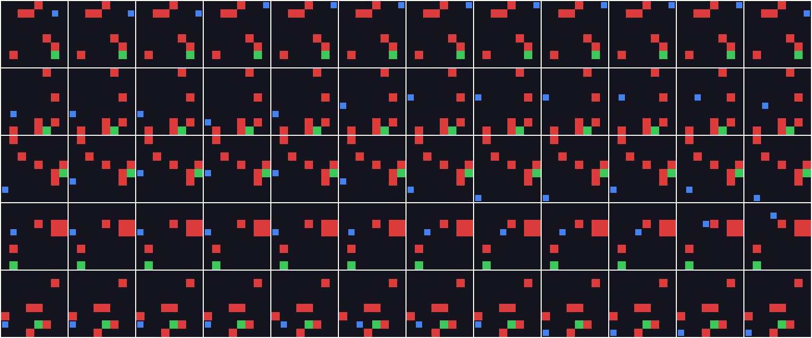

# World Models i en liten 2D-verden

Et demoprosjekt inspirert av [Ha & Schmidhuber (2018), *World Models*](https://worldmodels.github.io/).
Målet er å trene en agent nesten helt inne i sin egen "drøm": en lært modell av verden,
i stedet for i det ekte miljøet. Prosjektet er også et utstillingsvindu for vibekoding:
hvert steg bygges, testes og godkjennes før neste, og viktige valg logges i
[`decisions.md`](decisions.md).



*Fem episoder med tilfeldig policy, ett tidssteg per kolonne. Blå = agent, grønn = mål, rød = hindring.*

## Arkitektur

```
 ekte miljø ──► (1) rollouts ──► (2) VAE  ──► z_t        (V: komprimerer bilde til latent vektor)
  GridDodge     tilfeldig         64x64x3      │
                policy            → z          ▼
                                   (3) MDN-RNN: p(z_{t+1} | z_t, a_t, h_t)   (M: lærer dynamikken)
                                               │
                                   (4) controller a_t = f(z_t, h_t)          (C: trenes i drømmen)
                                               │
                                   (5) evaluering i ekte miljø
```

| Steg | Modul | Status |
|------|-------|--------|
| 1. Miljø + tilfeldige rollouts | `worldmodels/env`, `worldmodels/data` | ✅ ferdig, venter på godkjenning |
| 2. VAE | `worldmodels/vae` | ⏳ ikke påbegynt |
| 3. MDN-RNN | `worldmodels/mdnrnn` | ⏳ ikke påbegynt |
| 4. Controller trent i drømmen | `worldmodels/controller` | ⏳ ikke påbegynt |
| 5. Evaluering i ekte miljø | `worldmodels/evaluation` | ⏳ ikke påbegynt |

## Miljøet: GridDodge

Et 8x8-rutenett rendret som et 64x64 RGB-bilde (8 piksler per celle, samme oppløsning som i artikkelen).

- **Hver episode**: agent, mål og 6 hindringer plasseres tilfeldig. Et bredde-først-søk garanterer at målet kan nås.
- **Handlinger**: 4 diskrete (opp, ned, venstre, høyre). Å gå inn i kanten gjør at agenten blir stående.
- **Belønning**: +1 for å nå målet, −1 for å treffe en hindring (begge avslutter episoden), −0.01 per skritt.
- **Maks lengde**: 50 skritt, deretter avkortes episoden.
- **Avhengigheter**: bare NumPy.

Hvorfor akkurat dette miljøet er forklart i [`decisions.md`](decisions.md).

## Rollout-data

Hver episode lagres som `data/rollouts/episode_XXXXX.npz`:

| Felt | Form | Type | Betydning |
|------|------|------|-----------|
| `obs` | (T+1, 64, 64, 3) | uint8 | observasjon før hvert skritt, pluss siste observasjon |
| `actions` | (T,) | int64 | handling tatt i skritt t |
| `rewards` | (T,) | float32 | belønning for skritt t |
| `terminated` | (T,) | bool | traff mål eller hindring |
| `truncated` | (T,) | bool | avkortet etter 50 skritt |

Overgang *t* er `(obs[t], actions[t], obs[t+1])`, og `Episode.transitions()` gir disse direkte.

## Kom i gang

```bash
python -m venv .venv && source .venv/bin/activate
pip install -e ".[dev]"

# Kjør testene
pytest

# Steg 1: samle 1000 episoder med tilfeldig policy (~2 sekunder, ~4 MB)
python -m worldmodels.data --episodes 1000 --out data/rollouts

# Lag et forhåndsvisningsbilde
python -m worldmodels.env.preview --out preview.png --episodes 5 --frames 12
```

Med 1000 episoder og seed 0 gir den tilfeldige policyen 15 532 overganger
(snitt 15,5 skritt): 11 % når målet, 82 % treffer en hindring, 7 % avkortes.

## Prosjektstruktur

```
worldmodels/
  env/          GridDodge-miljøet og forhåndsvisning
  data/         tilfeldig policy og innsamling/lagring av rollouts
tests/          enhetstester (pytest)
docs/           bilder til README
decisions.md    logg over valg og begrunnelser
```
