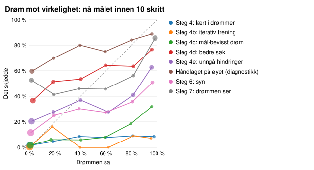
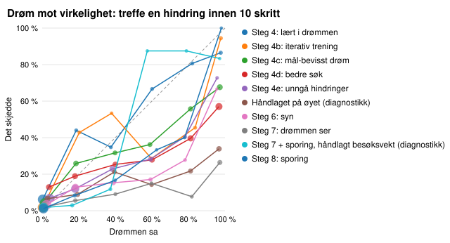
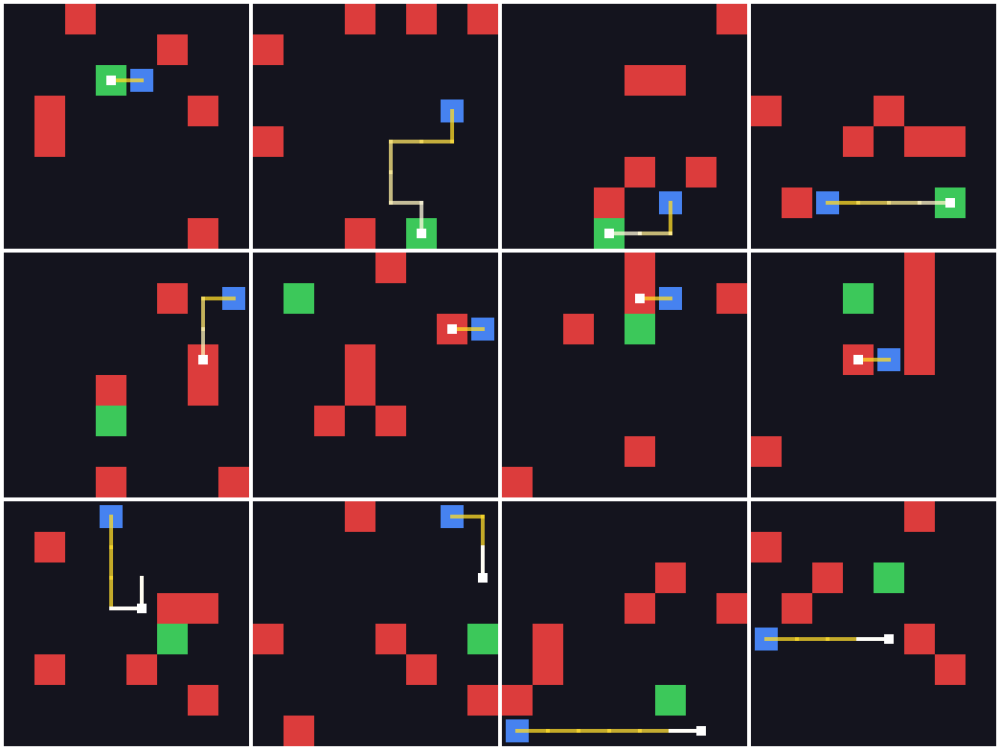
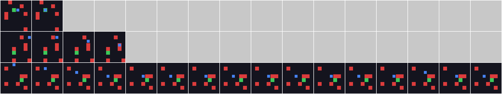

# Evaluering i det ekte miljøet

Alle policyer spilte de samme 2000 nye brettene (seeds 200000–201999), som ingen av dem har sett under trening. Tallene i parentes er 95 %-intervaller (Wilson for rater, bootstrap for avkastning). Policyer merket *juks* leser miljøets indre tilstand og er målestokker, ikke konkurrenter.

Generert av `python -m worldmodels.evaluation`. Tolkningen står i README.

## Hovedtabell

| Policy | Mål | Hindring | Avkortet | Avkastning | Snittlengde |
|---|---:|---:|---:|---:|---:|
| Tilfeldig | 12,8 % (11 %–14 %) | 80,5 % (79 %–82 %) | 6,7 % (6 %–8 %) | −0,83 (−0,86 – −0,80) | 15,9 |
| *Tilfeldig som unngår hindringer (juks)* | 30,8 % (29 %–33 %) | 0,0 % (0 %–0 %) | 69,2 % (67 %–71 %) | −0,10 (−0,13 – −0,08) | 41,5 |
| *Rett mot målet (juks)* | 66,3 % (64 %–68 %) | 33,7 % (32 %–36 %) | 0,0 % (0 %–0 %) | 0,30 (0,26 – 0,34) | 4,1 |
| *Rett mot målet, unngår hindringer (juks)* | 98,5 % (98 %–99 %) | 0,0 % (0 %–0 %) | 1,6 % (1 %–2 %) | 0,92 (0,91 – 0,93) | 7,3 |
| *Korteste vei (juks)* | 100,0 % (100 %–100 %) | 0,0 % (0 %–0 %) | 0,0 % (0 %–0 %) | 0,96 (0,95 – 0,96) | 5,5 |
| Steg 4: lært i drømmen | 7,2 % (6 %–8 %) | 35,7 % (34 %–38 %) | 57,1 % (55 %–59 %) | −0,58 (−0,61 – −0,56) | 30,4 |
| Steg 4b: iterativ trening | 5,7 % (5 %–7 %) | 28,0 % (26 %–30 %) | 66,4 % (64 %–68 %) | −0,56 (−0,58 – −0,54) | 34,4 |
| Steg 4c: mål-bevisst drøm | 9,9 % (9 %–11 %) | 46,4 % (44 %–49 %) | 43,7 % (42 %–46 %) | −0,62 (−0,64 – −0,59) | 25,9 |
| Steg 4d: bedre søk | 42,7 % (41 %–45 %) | 53,9 % (52 %–56 %) | 3,4 % (3 %–4 %) | −0,19 (−0,23 – −0,14) | 8,5 |
| Steg 4e: unngå hindringer | 40,8 % (39 %–43 %) | 31,9 % (30 %–34 %) | 27,3 % (25 %–29 %) | −0,12 (−0,15 – −0,08) | 21,4 |
| Håndlaget på øyet (diagnostikk) | 61,4 % (59 %–63 %) | 34,2 % (32 %–36 %) | 4,4 % (4 %–5 %) | 0,22 (0,18 – 0,26) | 6,3 |
| Steg 6: syn | 28,2 % (26 %–30 %) | 24,7 % (23 %–27 %) | 47,0 % (45 %–49 %) | −0,23 (−0,26 – −0,20) | 27,3 |

## Parvise sammenligninger på de samme brettene

Forskjell i prosentpoeng (a − b). «Bare a» er brett der a lyktes og b ikke, og omvendt.

| a | b | Mål, endring | Bare a / bare b | Hindring, endring |
|---|---|---:|---:|---:|
| Steg 4b: iterativ trening | Steg 4: lært i drømmen | −1,6 (−2,6 til −0,4) | 57 / 88 | −7,8 (−9,9 til −5,6) |
| Steg 4c: mål-bevisst drøm | Steg 4b: iterativ trening | +4,2 (+2,7 til +5,7) | 166 / 81 | +18,4 (+15,7 til +21,2) |
| Steg 4d: bedre søk | Steg 4c: mål-bevisst drøm | +32,8 (+30,5 til +35,0) | 736 / 80 | +7,5 (+4,5 til +10,5) |
| Steg 4e: unngå hindringer | Steg 4d: bedre søk | −1,8 (−4,3 til +0,7) | 309 / 346 | −22,1 (−24,7 til −19,4) |
| Steg 6: syn | Steg 4e: unngå hindringer | −12,6 (−15,1 til −10,2) | 193 / 445 | −7,2 (−9,4 til −5,0) |
| Steg 6: syn | Tilfeldig | +15,4 (+13,0 til +17,6) | 462 / 154 | −55,8 (−58,1 til −53,3) |
| Steg 6: syn | Rett mot målet, unngår hindringer (juks) | −70,2 (−72,2 til −68,2) | 2 / 1406 | +24,7 (+22,8 til +26,7) |
| Steg 6: syn | Håndlaget på øyet (diagnostikk) | −33,1 (−35,5 til −30,7) | 103 / 765 | −9,6 (−11,6 til −7,4) |

## Etter avstand til målet

Målrate etter korteste vei fra start til mål (rundt hindringene).

| Policy | 1–3 | 4–5 | 6–7 | 8+ |
|---|---:|---:|---:|---:|
| *Andel av brettene* | 27 % | 25 % | 24 % | 24 % |
| Tilfeldig | 27 % | 11 % | 7 % | 4 % |
| Tilfeldig som unngår hindringer (juks) | 55 % | 31 % | 20 % | 14 % |
| Rett mot målet (juks) | 94 % | 72 % | 56 % | 39 % |
| Rett mot målet, unngår hindringer (juks) | 100 % | 100 % | 98 % | 95 % |
| Korteste vei (juks) | 100 % | 100 % | 100 % | 100 % |
| Steg 4: lært i drømmen | 17 % | 6 % | 4 % | 1 % |
| Steg 4b: iterativ trening | 15 % | 4 % | 1 % | 0 % |
| Steg 4c: mål-bevisst drøm | 23 % | 8 % | 4 % | 3 % |
| Steg 4d: bedre søk | 58 % | 45 % | 36 % | 30 % |
| Steg 4e: unngå hindringer | 57 % | 41 % | 36 % | 27 % |
| Håndlaget på øyet (diagnostikk) | 87 % | 65 % | 54 % | 36 % |
| Steg 6: syn | 44 % | 28 % | 20 % | 18 % |

## Når hindringer står i veien

«Fri vei»: ingen hindring i rektangelet mellom start og mål, så enhver rett vei er trygg (44 % av brettene). «Hindring mellom»: minst én hindring står der en agent som går rett mot målet, kan treffe den.

| Policy | Mål, fri vei | Mål, hindring mellom | Krasj, fri vei | Krasj, hindring mellom |
|---|---:|---:|---:|---:|
| Tilfeldig | 23 % | 5 % | 70 % | 89 % |
| Tilfeldig som unngår hindringer (juks) | 45 % | 20 % | 0 % | 0 % |
| Rett mot målet (juks) | 100 % | 40 % | 0 % | 60 % |
| Rett mot målet, unngår hindringer (juks) | 100 % | 97 % | 0 % | 0 % |
| Korteste vei (juks) | 100 % | 100 % | 0 % | 0 % |
| Steg 4: lært i drømmen | 14 % | 2 % | 28 % | 42 % |
| Steg 4b: iterativ trening | 11 % | 1 % | 23 % | 32 % |
| Steg 4c: mål-bevisst drøm | 19 % | 3 % | 39 % | 52 % |
| Steg 4d: bedre søk | 63 % | 27 % | 32 % | 71 % |
| Steg 4e: unngå hindringer | 57 % | 28 % | 17 % | 43 % |
| Håndlaget på øyet (diagnostikk) | 92 % | 37 % | 3 % | 59 % |
| Steg 6: syn | 43 % | 17 % | 7 % | 38 % |

## Hvordan episodene ender

Pendling: avkortet, og innom høyst 3 ulike celler de siste 20 skrittene. Effektivitet: korteste vei delt på antall skritt brukt, for episoder som nådde målet (1,0 er perfekt).

| Policy | Avkortet | Av dem pendling | Effektivitet | Krasj i skritt 1–2 | Krasj i skritt 3–9 | Krasj i skritt 10+ |
|---|---:|---:|---:|---:|---:|---:|
| Tilfeldig | 133 | 10 | 0,47 | 314 | 501 | 795 |
| Tilfeldig som unngår hindringer (juks) | 1385 | 8 | 0,31 | 0 | 0 | 0 |
| Rett mot målet (juks) | 0 | 0 | 1,00 | 314 | 355 | 4 |
| Rett mot målet, unngår hindringer (juks) | 31 | 21 | 0,93 | 0 | 0 | 0 |
| Korteste vei (juks) | 0 | 0 | 1,00 | 0 | 0 | 0 |
| Steg 4: lært i drømmen | 1142 | 1139 | 0,90 | 276 | 390 | 48 |
| Steg 4b: iterativ trening | 1328 | 1314 | 0,89 | 243 | 297 | 19 |
| Steg 4c: mål-bevisst drøm | 874 | 746 | 0,70 | 286 | 451 | 191 |
| Steg 4d: bedre søk | 67 | 26 | 0,66 | 263 | 661 | 155 |
| Steg 4e: unngå hindringer | 545 | 348 | 0,55 | 187 | 275 | 176 |
| Håndlaget på øyet (diagnostikk) | 88 | 86 | 0,98 | 323 | 352 | 10 |
| Steg 6: syn | 941 | 911 | 0,74 | 215 | 214 | 65 |

## Vet M hvor agenten og målet er?

Mens agenten spiller: andel skritt der M sin tro peker på riktig celle, og snittfeil i celler. Kilde «minne»: troen M leser fra h før bildet er sett, så skritt 0 er en gjetning med tomt minne. Kilde «øye»: det øyet leser fra bildet i samme skritt (steg 6).

| Agent | Kilde | Skritt | Agent riktig | Agent feil (celler) | Mål riktig | Mål feil (celler) | Episoder |
|---|---|---|---:|---:|---:|---:|---:|
| Steg 4c: mål-bevisst drøm | minne | 0 | 1 % | 4,0 | 1 % | 4,0 | 2000 |
| Steg 4c: mål-bevisst drøm | minne | 1 | 4 % | 3,1 | 16 % | 2,4 | 1802 |
| Steg 4c: mål-bevisst drøm | minne | 2 | 34 % | 1,6 | 33 % | 1,8 | 1658 |
| Steg 4c: mål-bevisst drøm | minne | 5 | 83 % | 0,3 | 44 % | 1,5 | 1344 |
| Steg 4c: mål-bevisst drøm | minne | 10 | 92 % | 0,1 | 44 % | 1,5 | 1075 |
| Steg 4c: mål-bevisst drøm | minne | alle | 82 % | 0,5 | 40 % | 1,6 | 51732 |
| Steg 4d: bedre søk | minne | 0 | 1 % | 4,0 | 1 % | 4,0 | 2000 |
| Steg 4d: bedre søk | minne | 1 | 4 % | 3,2 | 17 % | 2,3 | 1811 |
| Steg 4d: bedre søk | minne | 2 | 25 % | 2,1 | 30 % | 1,9 | 1686 |
| Steg 4d: bedre søk | minne | 5 | 72 % | 0,6 | 39 % | 1,7 | 1138 |
| Steg 4d: bedre søk | minne | 10 | 78 % | 0,4 | 20 % | 2,4 | 341 |
| Steg 4d: bedre søk | minne | alle | 50 % | 1,4 | 22 % | 2,4 | 16909 |
| Steg 4e: unngå hindringer | minne | 0 | 1 % | 4,0 | 1 % | 4,0 | 2000 |
| Steg 4e: unngå hindringer | minne | 1 | 4 % | 3,2 | 17 % | 2,3 | 1839 |
| Steg 4e: unngå hindringer | minne | 2 | 37 % | 1,5 | 32 % | 1,8 | 1768 |
| Steg 4e: unngå hindringer | minne | 5 | 73 % | 0,5 | 39 % | 1,7 | 1504 |
| Steg 4e: unngå hindringer | minne | 10 | 81 % | 0,3 | 33 % | 2,0 | 1005 |
| Steg 4e: unngå hindringer | minne | alle | 66 % | 0,8 | 26 % | 2,2 | 42784 |
| Håndlaget på øyet (diagnostikk) | øye | 0 | 93 % | 0,2 | 89 % | 0,3 | 2000 |
| Håndlaget på øyet (diagnostikk) | øye | 1 | 92 % | 0,2 | 95 % | 0,2 | 1729 |
| Håndlaget på øyet (diagnostikk) | øye | 2 | 92 % | 0,2 | 94 % | 0,2 | 1422 |
| Håndlaget på øyet (diagnostikk) | øye | 5 | 84 % | 0,4 | 93 % | 0,2 | 642 |
| Håndlaget på øyet (diagnostikk) | øye | 10 | 46 % | 1,7 | 76 % | 0,8 | 122 |
| Håndlaget på øyet (diagnostikk) | øye | alle | 71 % | 0,9 | 86 % | 0,4 | 12507 |
| Steg 6: syn | øye | 0 | 93 % | 0,2 | 89 % | 0,3 | 2000 |
| Steg 6: syn | øye | 1 | 93 % | 0,2 | 94 % | 0,1 | 1814 |
| Steg 6: syn | øye | 2 | 94 % | 0,2 | 94 % | 0,2 | 1705 |
| Steg 6: syn | øye | 5 | 89 % | 0,3 | 95 % | 0,1 | 1405 |
| Steg 6: syn | øye | 10 | 86 % | 0,4 | 94 % | 0,2 | 1115 |
| Steg 6: syn | øye | alle | 87 % | 0,3 | 92 % | 0,2 | 54565 |

## Drøm mot virkelighet

Etter 5 ekte skritt drømmer agenten 10 skritt videre fra nøyaktig den tilstanden (temperatur 0, som i treningen). Så spiller den de samme skrittene i det ekte miljøet. Drømmen er ærlig når snittet av M sine sannsynligheter er nær den ekte raten. AUC sier hvor godt M skiller brettene der det skjer fra dem der det ikke skjer (0,5 er gjetting).

| Agent | Starter | Mål: drøm | Mål: ekte | Mål: AUC | Hindring: drøm | Hindring: ekte | Hindring: AUC |
|---|---:|---:|---:|---:|---:|---:|---:|
| Steg 4: lært i drømmen | 1358 | 9,6 % | 2,5 % (2 %–3 %) | 0,82 | 6,9 % | 12,3 % (11 %–14 %) | 0,94 |
| Steg 4b: iterativ trening | 1436 | 3,1 % | 0,8 % (0 %–1 %) | 0,91 | 4,9 % | 6,0 % (5 %–7 %) | 0,97 |
| Steg 4c: mål-bevisst drøm | 1344 | 11,9 % | 4,2 % (3 %–5 %) | 0,85 | 27,3 % | 22,2 % (20 %–25 %) | 0,87 |
| Steg 4d: bedre søk | 1138 | 30,8 % | 49,8 % (47 %–53 %) | 0,65 | 57,0 % | 34,3 % (32 %–37 %) | 0,71 |
| Steg 4e: unngå hindringer | 1504 | 35,4 % | 32,0 % (30 %–34 %) | 0,68 | 18,9 % | 13,2 % (12 %–15 %) | 0,70 |
| Håndlaget på øyet (diagnostikk) | 642 | 27,9 % | 68,8 % (65 %–72 %) | 0,67 | 45,0 % | 17,0 % (14 %–20 %) | 0,71 |
| Steg 6: syn | 1405 | 19,7 % | 18,8 % (17 %–21 %) | 0,73 | 11,2 % | 7,0 % (6 %–8 %) | 0,75 |

## Episoder fra sluttagenten

Steg 6: syn. Øverste rad nådde målet, midterste traff en hindring, nederste ble avkortet. Streken går fra gul (start) til hvit (slutt), og det hvite kvadratet er der episoden endte.

Den første episoden av hvert utfall, skritt for skritt (16 første bilder):

## Samme brett, to agenter

Brett der Steg 4e: unngå hindringer (øverst) krasjet og Steg 6: syn (nederst) kom frem.

