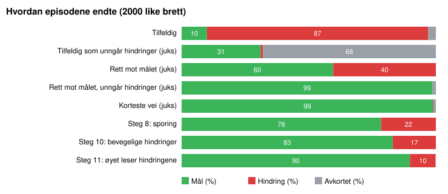
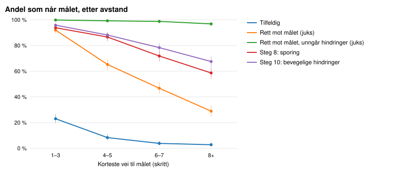
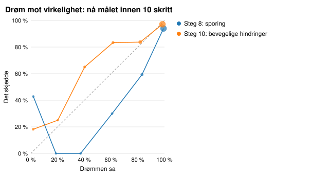
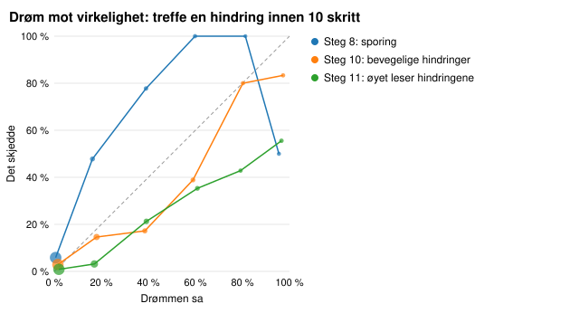
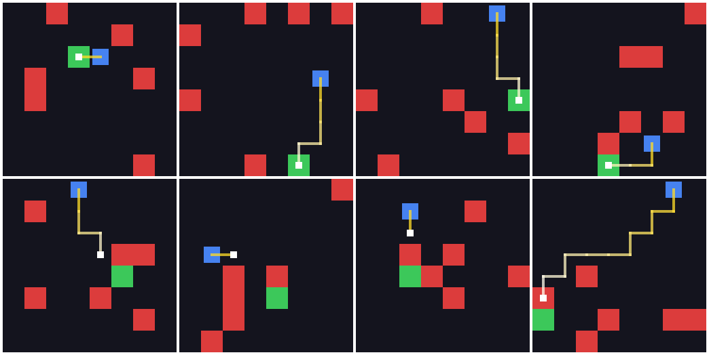
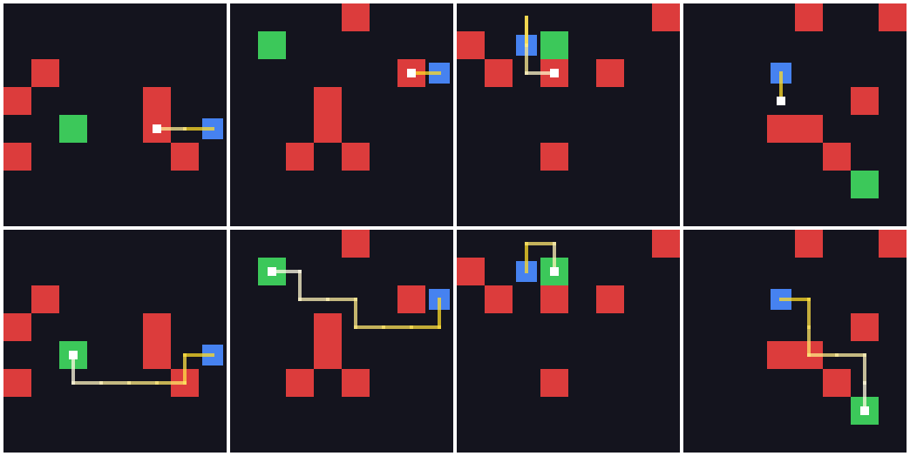

# Evaluering med bevegelige hindringer

Alle policyer spilte de samme 2000 nye brettene (seeds 200000–201999), som ingen av dem har sett under trening. Tallene i parentes er 95 %-intervaller (Wilson for rater, bootstrap for avkastning). Policyer merket *juks* leser miljøets indre tilstand og er målestokker, ikke konkurrenter.

Generert av `python -m worldmodels.evaluation`. Tolkningen står i README.

I denne verdenen beveger 3 av hindringene seg én celle per skritt og snur når de møter noe (steg 10). Juks-grunnlinjene vet også hvor hindringene står etter neste skritt.

## Hovedtabell

| Policy | Mål | Hindring | Avkortet | Avkastning | Snittlengde |
|---|---:|---:|---:|---:|---:|
| Tilfeldig | 10,0 % (9 %–11 %) | 87,1 % (86 %–88 %) | 3,0 % (2 %–4 %) | −0,87 (−0,90 – −0,85) | 11,4 |
| *Tilfeldig som unngår hindringer (juks)* | 31,1 % (29 %–33 %) | 0,9 % (1 %–1 %) | 68,0 % (66 %–70 %) | −0,10 (−0,13 – −0,07) | 40,5 |
| *Rett mot målet (juks)* | 59,6 % (57 %–62 %) | 40,4 % (38 %–43 %) | 0,0 % (0 %–0 %) | 0,16 (0,12 – 0,21) | 3,8 |
| *Rett mot målet, unngår hindringer (juks)* | 98,7 % (98 %–99 %) | 0,1 % (0 %–0 %) | 1,2 % (1 %–2 %) | 0,93 (0,92 – 0,93) | 7,0 |
| *Korteste vei (juks)* | 98,9 % (98 %–99 %) | 0,2 % (0 %–1 %) | 0,9 % (1 %–1 %) | 0,93 (0,93 – 0,94) | 6,4 |
| Steg 8: sporing | 78,5 % (77 %–80 %) | 21,6 % (20 %–23 %) | 0,0 % (0 %–0 %) | 0,53 (0,50 – 0,57) | 4,8 |
| Steg 10: bevegelige hindringer | 83,0 % (81 %–85 %) | 17,0 % (15 %–19 %) | 0,0 % (0 %–0 %) | 0,62 (0,59 – 0,65) | 5,1 |

## Parvise sammenligninger på de samme brettene

Forskjell i prosentpoeng (a − b). «Bare a» er brett der a lyktes og b ikke, og omvendt.

| a | b | Mål, endring | Bare a / bare b | Hindring, endring |
|---|---|---:|---:|---:|
| Steg 10: bevegelige hindringer | Steg 8: sporing | +4,6 (+3,2 til +6,0) | 152 / 60 | −4,6 (−6,0 til −3,2) |
| Steg 10: bevegelige hindringer | Tilfeldig | +73,1 (+71,2 til +75,0) | 1471 / 9 | −70,1 (−72,0 til −68,0) |
| Steg 10: bevegelige hindringer | Rett mot målet, unngår hindringer (juks) | −15,7 (−17,2 til −14,0) | 6 / 319 | +16,9 (+15,2 til +18,5) |

## Etter avstand til målet

Målrate etter korteste vei fra start til mål (rundt hindringene).

| Policy | 1–3 | 4–5 | 6–7 | 8+ |
|---|---:|---:|---:|---:|
| *Andel av brettene* | 27 % | 25 % | 24 % | 24 % |
| Tilfeldig | 23 % | 8 % | 4 % | 3 % |
| Tilfeldig som unngår hindringer (juks) | 58 % | 32 % | 17 % | 12 % |
| Rett mot målet (juks) | 92 % | 65 % | 47 % | 29 % |
| Rett mot målet, unngår hindringer (juks) | 100 % | 99 % | 99 % | 97 % |
| Korteste vei (juks) | 100 % | 99 % | 99 % | 98 % |
| Steg 8: sporing | 94 % | 87 % | 72 % | 59 % |
| Steg 10: bevegelige hindringer | 96 % | 88 % | 78 % | 68 % |

## Når hindringer står i veien

«Fri vei»: ingen hindring i rektangelet mellom start og mål, så enhver rett vei er trygg (44 % av brettene). «Hindring mellom»: minst én hindring står der en agent som går rett mot målet, kan treffe den.

| Policy | Mål, fri vei | Mål, hindring mellom | Krasj, fri vei | Krasj, hindring mellom |
|---|---:|---:|---:|---:|
| Tilfeldig | 18 % | 4 % | 79 % | 93 % |
| Tilfeldig som unngår hindringer (juks) | 45 % | 20 % | 1 % | 1 % |
| Rett mot målet (juks) | 91 % | 35 % | 9 % | 65 % |
| Rett mot målet, unngår hindringer (juks) | 100 % | 98 % | 0 % | 0 % |
| Korteste vei (juks) | 100 % | 98 % | 0 % | 0 % |
| Steg 8: sporing | 92 % | 68 % | 8 % | 32 % |
| Steg 10: bevegelige hindringer | 94 % | 74 % | 6 % | 26 % |

## Hvordan episodene ender

Pendling: avkortet, og innom høyst 3 ulike celler de siste 20 skrittene. Effektivitet: korteste vei delt på antall skritt brukt, for episoder som nådde målet (1,0 er perfekt).

| Policy | Avkortet | Av dem pendling | Effektivitet | Krasj i skritt 1–2 | Krasj i skritt 3–9 | Krasj i skritt 10+ |
|---|---:|---:|---:|---:|---:|---:|
| Tilfeldig | 60 | 7 | 0,55 | 444 | 670 | 627 |
| Tilfeldig som unngår hindringer (juks) | 1361 | 4 | 0,34 | 0 | 7 | 11 |
| Rett mot målet (juks) | 0 | 0 | 1,00 | 391 | 413 | 4 |
| Rett mot målet, unngår hindringer (juks) | 25 | 13 | 0,93 | 0 | 1 | 0 |
| Korteste vei (juks) | 19 | 18 | 0,95 | 0 | 4 | 0 |
| Steg 8: sporing | 0 | 0 | 0,97 | 205 | 215 | 11 |
| Steg 10: bevegelige hindringer | 0 | 0 | 0,95 | 135 | 190 | 14 |

## Vet M hvor agenten og målet er?

Mens agenten spiller: andel skritt der M sin tro peker på riktig celle, og snittfeil i celler. Kilde «minne»: troen M leser fra h før bildet er sett, så skritt 0 er en gjetning med tomt minne. Kilde «øye»: det øyet leser fra bildet i samme skritt (steg 6).

| Agent | Kilde | Skritt | Agent riktig | Agent feil (celler) | Mål riktig | Mål feil (celler) | Episoder |
|---|---|---|---:|---:|---:|---:|---:|
| Steg 8: sporing | øye + sporing | 0 | 92 % | 0,2 | 89 % | 0,3 | 2000 |
| Steg 8: sporing | øye + sporing | 1 | 99 % | 0,0 | 97 % | 0,1 | 1783 |
| Steg 8: sporing | øye + sporing | 2 | 100 % | 0,0 | 97 % | 0,1 | 1551 |
| Steg 8: sporing | øye + sporing | 5 | 100 % | 0,0 | 99 % | 0,0 | 728 |
| Steg 8: sporing | øye + sporing | 10 | 100 % | 0,0 | 98 % | 0,0 | 54 |
| Steg 8: sporing | øye + sporing | alle | 98 % | 0,0 | 96 % | 0,1 | 9550 |
| Steg 10: bevegelige hindringer | øye + sporing | 0 | 92 % | 0,2 | 89 % | 0,3 | 2000 |
| Steg 10: bevegelige hindringer | øye + sporing | 1 | 99 % | 0,0 | 96 % | 0,1 | 1821 |
| Steg 10: bevegelige hindringer | øye + sporing | 2 | 100 % | 0,0 | 98 % | 0,1 | 1618 |
| Steg 10: bevegelige hindringer | øye + sporing | 5 | 100 % | 0,0 | 100 % | 0,0 | 820 |
| Steg 10: bevegelige hindringer | øye + sporing | 10 | 100 % | 0,0 | 100 % | 0,0 | 83 |
| Steg 10: bevegelige hindringer | øye + sporing | alle | 98 % | 0,0 | 96 % | 0,1 | 10205 |

## Drøm mot virkelighet

Etter 5 ekte skritt drømmer agenten 10 skritt videre fra nøyaktig den tilstanden (temperatur 0, som i treningen). Så spiller den de samme skrittene i det ekte miljøet. Drømmen er ærlig når snittet av M sine sannsynligheter er nær den ekte raten. AUC sier hvor godt M skiller brettene der det skjer fra dem der det ikke skjer (0,5 er gjetting).

| Agent | Starter | Mål: drøm | Mål: ekte | Mål: AUC | Hindring: drøm | Hindring: ekte | Hindring: AUC |
|---|---:|---:|---:|---:|---:|---:|---:|
| Steg 8: sporing | 728 | 96,6 % | 90,4 % (88 %–92 %) | 0,83 | 2,8 % | 9,3 % (7 %–12 %) | 0,85 |
| Steg 10: bevegelige hindringer | 820 | 92,3 % | 93,0 % (91 %–95 %) | 0,85 | 6,9 % | 6,5 % (5 %–8 %) | 0,84 |

## Episoder fra sluttagenten

Steg 10: bevegelige hindringer. Øverste rad nådde målet, midterste traff en hindring, nederste ble avkortet. Streken går fra gul (start) til hvit (slutt), og det hvite kvadratet er der episoden endte.

Den første episoden av hvert utfall, skritt for skritt (16 første bilder):

## Samme brett, to agenter

Brett der Steg 8: sporing (øverst) krasjet og Steg 10: bevegelige hindringer (nederst) kom frem.

