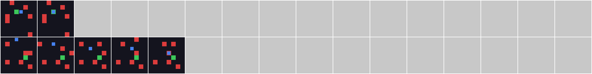
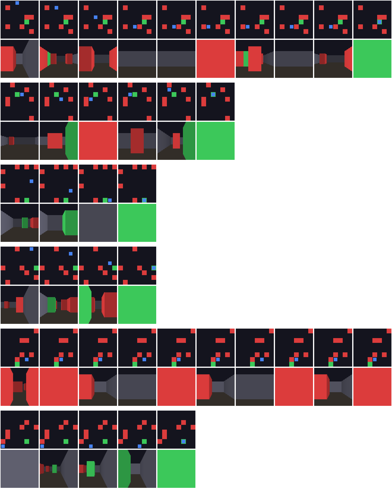

# Steg for steg: kommandoer og resultater

Dette er detaljene bak [README-en](../README.md) og [oversiktssiden](index.html): hvordan hvert steg
kjøres, og tallene fra hvert steg. Alle kommandoer kjøres fra rotmappen i repoet. Begrunnelsene for
valgene står i [`decisions.md`](../decisions.md).

## Rollout-data

Hver episode lagres som `data/rollouts/episode_XXXXX.npz`:

| Felt | Form | Type | Betydning |
|------|------|------|-----------|
| `obs` | (T+1, 64, 64, 3) | uint8 | observasjon før hvert skritt, pluss siste observasjon |
| `actions` | (T,) | int64 | handling tatt i skritt t |
| `rewards` | (T,) | float32 | belønning for skritt t |
| `terminated` | (T,) | bool | traff mål eller hindring |
| `truncated` | (T,) | bool | avkortet etter 50 skritt |

Overgang *t* er `(obs[t], actions[t], obs[t+1])`, og `Episode.transitions()` gir disse direkte.

## Kom i gang

```bash
python -m venv .venv && source .venv/bin/activate
pip install -e ".[dev]"

# Kjør testene
pytest

# Steg 1: samle 1000 episoder med tilfeldig policy (~2 sekunder, ~4 MB)
python -m worldmodels.data --episodes 1000 --out data/rollouts

# Lag et forhåndsvisningsbilde
python -m worldmodels.env.preview --out preview.png --episodes 5 --frames 12
```

Med 1000 episoder og seed 0 gir den tilfeldige policyen 15 532 overganger
(snitt 15,5 skritt): 11 % når målet, 82 % treffer en hindring, 7 % avkortes.

### Steg 2: tren og evaluer VAE-en

VAE-en trenger mange *layouter*, ikke bare mange bilder (se D12 i `decisions.md`).
Derfor samler vi 20 000 episoder og bruker høyst 4 bilder fra hver.

```bash
python -m worldmodels.data --episodes 20000 --out data/rollouts_20k                # ~35 s, 84 MB

python -m worldmodels.vae.train --data data/rollouts_20k --frames-per-episode 4 \
    --latent-dim 32 --object-weight 10 --epochs 12 --out checkpoints/vae_z32_w10.pt  # ~45 min på CPU

python -m worldmodels.vae.evaluate checkpoints/vae_z32_w10.pt \
    --data data/rollouts_20k --frames-per-episode 4 --image recon.png
```

### Steg 3: kod z-sekvenser, tren og evaluer MDN-RNN-en

```bash
python -m worldmodels.mdnrnn.encode --vae checkpoints/vae_z32_w10.pt \
    --data data/rollouts_20k --out data/zseq_20k.npz                           # ~3 min

python -m worldmodels.mdnrnn.train --data data/zseq_20k.npz \
    --out checkpoints/mdnrnn.pt                                                # 30 epoker, ~15 min

python -m worldmodels.mdnrnn.evaluate checkpoints/mdnrnn.pt \
    --vae checkpoints/vae_z32_w10.pt --image dream.png
```

### Steg 4: tren controlleren i drømmen

```bash
python -m worldmodels.controller.train --vae checkpoints/vae_z32_w10.pt \
    --rnn checkpoints/mdnrnn_direct_k5.pt --data data/zseq_20k.npz \
    --generations 300 --starts 256 --out checkpoints/controller.npz            # ~20 min
```

Loggen viser både hvor godt controlleren gjør det i drømmen og i det ekte miljøet.

### Steg 4b: iterativ trening

```bash
python -m worldmodels.controller.iterate --vae checkpoints/vae_z32_w10.pt \
    --rnn checkpoints/mdnrnn_direct_k5.pt --controller checkpoints/controller_s256.npz \
    --data data/zseq_20k.npz --rounds 3 --out-dir checkpoints/iter          # ~8 min per runde
```

Hver runde samler 5000 ekte episoder med controlleren (30 % tilfeldige handlinger), trener
MDN-RNN-en og controlleren videre, og måler resultatet. Alt lagres i `checkpoints/iter/`.

### Steg 4c: mål-bevisst drøm

```bash
# Kod dataene på nytt, så målets celle kommer med (gjør det samme for rollouts fra 4b)
python -m worldmodels.mdnrnn.encode --data data/rollouts_20k --out data/v2/zseq_20k.npz

# MDN-RNN med hjelpehode for agentens og målets posisjon                    # ~55 min på CPU
python -m worldmodels.mdnrnn.train --data data/v2/zseq_20k.npz data/v2/zseq_r1.npz \
    data/v2/zseq_r2.npz data/v2/zseq_r3.npz --epochs 30 --position-weight 1 --out checkpoints/mdnrnn_pos.pt

# Controller med M sin tro om posisjoner, i en drøm som ikke belønner å gjemme seg
python -m worldmodels.controller.train --rnn checkpoints/mdnrnn_pos.pt --data data/v2/zseq_*.npz \
    --use-positions --charge-remaining --temperature 0 --generations 300 --starts 256
```

### Steg 4d: bedre søk

```bash
# CMA-ES med formet belønning. --zh-std 0 gir controlleren med bare posisjonstroen (20 parametre).
python -m worldmodels.controller.train --rnn checkpoints/mdnrnn_pos.pt --data data/v2/zseq_*.npz \
    --use-positions --charge-remaining --temperature 0 --shaping 0.05 \
    --optimizer cma --sigma 0.5 --zh-std 0.03 --generations 300 --starts 256   # ~20 min
```

### Steg 4e: unngå hindringer

```bash
# Posisjonstro + fremsyn (M spør "hva skjer om jeg går hit?" for hver handling)
python -m worldmodels.controller.train --rnn checkpoints/mdnrnn_pos.pt --data data/v2/zseq_*.npz \
    --use-positions --lookahead --charge-remaining --temperature 0 --shaping 0.05 \
    --optimizer cma --sigma 0.5 --zh-std 0 --generations 200 --starts 256   # ~35 min
```

### Steg 5: evaluering i ekte miljø

```bash
# Alle controllerne og fem grunnlinjer på de samme 2000 nye brettene (~4 min på 4 CPU-er).
# Skriver docs/evaluation/report.md, results.json og figurene. Mangler et sjekkpunkt, hoppes det over.
python -m worldmodels.evaluation --out docs/evaluation
```

### Steg 6: bedre syn

```bash
# Øyet: leser agentens og målets celle fra z, legges til M (~6 min)
python -m worldmodels.mdnrnn.eye --rnn checkpoints/mdnrnn_pos.pt --data data/v3/zseq_*.npz \
    --out checkpoints/mdnrnn_eye.pt
# Controller på syn + fremsyn, samme oppsett som 4e (~45 min)
python -m worldmodels.controller.train --rnn checkpoints/mdnrnn_eye.pt --data data/v3/zseq_*.npz \
    --use-eye --lookahead --charge-remaining --temperature 0 --shaping 0.05 \
    --optimizer cma --sigma 0.5 --zh-std 0 --generations 200 --starts 256 --out checkpoints/controller_eye_look.npz
```

### Steg 7: drømmen ser

```bash
# Nærsynet: spår mål og hindring i hver nabocelle fra bildet og øyets målminne (~9 min)
python -m worldmodels.mdnrnn.neighbours --rnn checkpoints/mdnrnn_eye.pt --data data/v3/zseq_*.npz \
    --out checkpoints/mdnrnn_sense.pt
# Samme controlleroppsett som steg 6, men i drømmen som nå spår hendelser fra nærsynet (~75 min)
python -m worldmodels.controller.train --rnn checkpoints/mdnrnn_sense.pt --data data/v3/zseq_*.npz \
    --use-eye --lookahead --charge-remaining --temperature 0 --shaping 0.05 \
    --optimizer cma --sigma 0.5 --zh-std 0 --generations 200 --starts 256 --seed 1 --out checkpoints/controller_sense.npz
```

### Steg 8: slutt på pendlingen

```bash
# Hvorfor steg 7 pendler, og steg 7-controlleren med sporing og håndlagt besøksvekt (~3 min)
PYTHONPATH=. python docs/experiments/scripts/oscillation.py
# Samme M og oppsett som steg 7, men controlleren får sporing og besøksminne (~65 min)
python -m worldmodels.controller.train --rnn checkpoints/mdnrnn_sense.pt --data data/v3/zseq_*.npz \
    --use-eye --track --lookahead --charge-remaining --temperature 0 --shaping 0.05 \
    --optimizer cma --sigma 0.5 --zh-std 0 --generations 200 --starts 256 --seed 1 --out checkpoints/controller_track.npz
```

### Steg 9: vis drømmen

```bash
# Tar opp 11 brett med sluttagenten og skriver én selvstendig HTML-fil (~1 min, ~0,7 MB).
# Fra steg 12 er standard den bevegelige verdenen; dette gir siden fra steg 9:
python -m worldmodels.dreamview --moving 0 --rnn mdnrnn_sense.pt --controller controller_track.npz \
    --previous-rnn mdnrnn_sense.pt --previous controller_sense.npz --previous-name "Steg 7" --out docs/drom/index.html
```

### Steg 10: bevegelige hindringer

```bash
# Data fra verdenen der 3 av 6 hindringer beveger seg: tilfeldig og med steg 8-agenten
python -m worldmodels.data --episodes 20000 --moving 3 --out data/moving/rollouts_20k
PYTHONPATH=. python docs/experiments/scripts/agent_rollouts.py --moving 3 --episodes 10000 --out data/moving/rollouts_agent
python -m worldmodels.mdnrnn.encode --data data/moving/rollouts_20k --out data/moving/zseq_20k.npz
python -m worldmodels.mdnrnn.encode --data data/moving/rollouts_agent --out data/moving/zseq_agent.npz
# M finjusteres fra steg 7/8-modellen, og nærsynet får M sitt minne (--memory)
python -m worldmodels.mdnrnn.train --data data/moving/zseq_*.npz --init-from checkpoints/mdnrnn_sense.pt \
    --epochs 10 --lr 5e-4 --out checkpoints/mdnrnn_moving_core.pt
python -m worldmodels.mdnrnn.train --data data/moving/zseq_*.npz --init-from checkpoints/mdnrnn_moving_core.pt \
    --epochs 20 --lr 3e-4 --out checkpoints/mdnrnn_moving_core30.pt
python -m worldmodels.mdnrnn.neighbours --rnn checkpoints/mdnrnn_moving_core30.pt --data data/moving/zseq_*.npz \
    --memory --epochs 8 --out checkpoints/mdnrnn_moving.pt
# Samme controlleroppsett som steg 8, i den nye drømmen; de ekte kontrollene kjøres med bevegelige hindringer
python -m worldmodels.controller.train --rnn checkpoints/mdnrnn_moving.pt --data data/moving/zseq_*.npz \
    --use-eye --track --lookahead --charge-remaining --temperature 0 --shaping 0.05 \
    --optimizer cma --sigma 0.5 --zh-std 0 --generations 200 --starts 256 --seed 0 --moving 3 --out checkpoints/controller_moving.npz
# Evaluering i verdenen med bevegelige hindringer, og hvor krasjene skjer
python -m worldmodels.evaluation --moving 3 --out docs/evaluation_moving
PYTHONPATH=. python docs/experiments/scripts/crash_check.py mdnrnn_sense.pt:controller_track.npz mdnrnn_moving.pt:controller_moving.npz
```

### Steg 11: øyet leser hindringene

```bash
# Kod agentdataene på nytt, så hindringskartet for hvert bilde kommer med (~40 s)
python -m worldmodels.mdnrnn.encode --data data/moving/rollouts_agent --out data/moving/zseq_agent.npz
# Hindringsøyet og bevegelsen, lagt til steg 10-modellen (~1 min)
python -m worldmodels.mdnrnn.obstacles --rnn checkpoints/mdnrnn_moving.pt --data data/moving/zseq_agent.npz \
    --out checkpoints/mdnrnn_obstacles.pt
# Ingen ny controller: steg 10-controlleren bruker den nye M direkte. Evaluering som i steg 10.
python -m worldmodels.evaluation --moving 3 --out docs/evaluation_moving
```

### Steg 12: drømmesiden i den bevegelige verdenen

```bash
# Sluttagenten fra steg 11 med tre bevegelige hindringer (~30 s, ~1,3 MB)
python -m worldmodels.dreamview --out docs/drom/index.html
```

## Resultater fra steg 2


*Øverst: originaler fra valideringsepisoder (layouter VAE-en aldri har sett). Deretter
16 dim uten vekting, 16 dim med objektvekting og 32 dim med objektvekting.*

| Variant | Pikselfeil (MSE) | Riktige celler | Hele layouten riktig | Agent i riktig celle | Probe agent: lineær / MLP |
|---------|-----:|-----:|-----:|-----:|-----:|
| 16 dim, uten vekting | 0,0068 | 96,2 % | 0 % | 0 % | 3 % / 3 % |
| 16 dim, vekt 10 | 0,0036 | 98,2 % | 30 % | 77 % | 2 % / 34 % |
| **32 dim, vekt 10** | **0,0016** | **99,2 %** | **65 %** | **90 %** | **11 % / 53 %** |

Alle tall er på valideringsepisodene. Tilfeldig gjetting på agentens celle gir 1,6 %, og et bilde
med bare bakgrunn og hindringer gir ~87 % riktige celler.

- **Objektvektingen er avgjørende.** Uten den tegner VAE-en aldri agenten eller målet.
- **32 dimensjoner slår 16** på alle mål, så `vae_z32_w10` er modellen vi bygger videre på.
- **Posisjonen er i z, men ikke lineært.** En lineær probe finner agentens celle i 11 % av tilfellene,
  en liten MLP i 53 %. Det påvirker valget av controller senere (se D14).
- Det første forsøket med bare 1000 episoder overtilpasset seg til layoutene. Resultatene ligger i
  `docs/experiments/vae_1000ep_*`.

## Resultater fra steg 3

MDN-RNN-en tar inn z_t og handlingen, og predikerer neste z og om skrittet ender i mål, hindring
eller et vanlig flytt. Alle tall er på valideringsepisoder, og posisjonen leses av ved å dekode
prediksjonen med VAE-en.

| Mål | Artikkelens oppsett | Valgt modell | Grunnlinje: ingenting endrer seg |
|-----|-----:|-----:|-----:|
| Agenten i riktig celle etter ett skritt | 50 % | **58 %** | 28 % |
| ... når agenten faktisk flyttet seg | 33 % | **44 %** | 0 % |
| Drøm etter 5 ekte skritt: riktig celle etter 1 / 6 drømte skritt | 32 % / 21 % | **43 % / 29 %** | 27 % / 14 % |
| Treff på mål / hindring | 0 % / 14 % | 16 % / 42 % | – |
| Lineær probe: agentens celle fra (z, h) | 89 % | 84 % | fra z alene: 16 % |


*To rader per episode: øverst det som faktisk skjedde, under drømmen. De fem første bildene er
ekte, deretter drømmer modellen med de samme handlingene. Drømmen holder seg nær virkeligheten
noen skritt, men sporer av: agenter blir borte, og mål dukker opp der det ikke var noe.*

- **Minnet løser problemet fra steg 2.** Agentens posisjon kan ikke leses lineært fra z (16 %), men
  fra RNN-ens skjulte tilstand kan den (84 %). En lineær controller på (z, h), som i artikkelen,
  er dermed realistisk.
- **Drømmer trenger oppvarming.** Fra kald start kopierer modellen bare z. Etter 5 ekte skritt
  slår den grunnlinjen tydelig.
- **Mål er vanskelige å forutse** (16 %). Det er den største svakheten før steg 4.
- Veien hit gikk gjennom 8 varianter. Se D20–D22 i `decisions.md`.

## Resultater fra steg 4

En lineær controller på [z, h] trenes med en evolusjonsstrategi, bare i drømmen. Drømmene starter
etter 5 ekte oppvarmingsskritt og varer 10 skritt. Deretter måles den i det ekte miljøet på
episoder den aldri har sett.

| Policy | Mål | Hindring | Avkortet | Avkastning |
|---|---:|---:|---:|---:|
| Tilfeldig | 11 % | 82 % | 7 % | −0,85 |
| **Controller trent i drømmen** | 6 % | 38 % | 57 % | −0,62 |
| Korteste vei (juks, kjenner kartet) | 100 % | 0 % | 0 % | +0,95 |

- **Den har lært å unngå hindringer.** Den krasjer halvparten så ofte som tilfeldig.
- **Men den finner ikke målet.** Den går mest mot høyre, blir stående ved veggen og venter ut tiden.
- **Drømmen blir lurt.** Drømmen tror controlleren når målet i opptil 36 % av tilfellene, mens det
  i virkeligheten skjer i 7 %. MDN-RNN-en forutser bare 16 % av mål-hendelsene, så controlleren
  lærer å utnytte feil i drømmen i stedet for å finne målet.
- Høyere temperatur i drømmen, som artikkelen foreslår, hjalp ikke. Se D26–D27.

## Resultater fra steg 4b

Controlleren samler nye ekte data, MDN-RNN-en trenes videre på dem, og controlleren trenes på
nytt i den bedre drømmen. Tre runder, 1000 ekte evalueringsepisoder per runde:

| Runde | Drøm: mål | Ekte: mål | Hindring | Avkortet | Avkastning |
|---|---:|---:|---:|---:|---:|
| 0 (steg 4) | 36 % | 8 % | 35 % | 57 % | −0,57 |
| 1 | 5 % | 6 % | 33 % | 61 % | −0,58 |
| 3 | 8 % | 6 % | 30 % | 65 % | −0,57 |

- **Drømmen lures ikke lenger.** Allerede etter første runde stemmer drømmens målrate med virkeligheten.
- **Krasjene går ned** fra 35 % til 30 %, og M forutser nå 66 % av krasjene i controllerens
  data (før: 37 %).
- **Målet er fortsatt flaskehalsen.** M forutser bare 17 % av mål-hendelsene, og en helt ny
  controller trent i den nye drømmen når målet i bare 3 %. Se D28–D30.

## Resultater fra steg 4c

Vi lærte MDN-RNN-en å holde orden på hvor agenten og målet er, ga controlleren den troen som
4 ekstra tall, og rettet to feil i drømmen som gjorde det lønnsomt å gjemme seg.

| Controller (ekte miljø, 1000 episoder) | Mål | Hindring | Avkastning |
|---|---:|---:|---:|
| Tilfeldig | 11 % | 82 % | −0,85 |
| Steg 4 | 8 % | 35 % | −0,57 |
| Ny M + posisjonstro + læreplan | 10 % | 44 % | −0,61 |
| *Håndlaget "gå mot målet" på M sin tro (diagnostikk)* | *40 %* | *56 %* | *−0,24* |

- **M forutser dobbelt så mange mål** (23 % mot 10 %) og vet hvor målet er i 52 % av skrittene (før: 3 %).
- **Verdensmodellen holder nå.** En controller som bare går dit M tror målet er, når målet i 40 %,
  og drømmen rangerer den over "vent ved veggen".
- **Men søket finner den ikke.** Evolusjonsstrategien havner i "vent ved veggen" fra null, selv
  med 20 parametre og mer støy. Startet i den håndlagde løsningen blir den der. Se D31–D35.

## Resultater fra steg 4d

| Controller (ekte miljø, 1000 episoder) | Mål | Hindring | Avkastning |
|---|---:|---:|---:|
| Tilfeldig | 11 % | 82 % | −0,85 |
| Steg 4 | 8 % | 35 % | −0,57 |
| CMA-ES + formet belønning, z/h-spredning 0,03 | 40 % | 55 % | −0,25 |
| **CMA-ES + formet belønning, bare posisjonstro (20 parametre)** | **41 %** | **55 %** | **−0,22** |

- **Bedre søk alene var ikke nok.** CMA-ES, omstarter og flere drømmer per kandidat endte alle
  ved veggen. "Gå mot målet" er en smal topp i et flatt landskap, så ingen søkemetode fikk signal.
- **Formet belønning fra M sin egen tro ga søket en bakke.** Drømmen gir litt belønning per celle
  nærmere målet, ut fra der M *tror* agenten og målet er. Den er potensialbasert, så den endrer
  ikke hva som er best.
- **Den lærte controlleren slår den håndlagde**, og den beste bruker bare 20 parametre.
- **Neste svakhet er hindringer:** den går rett mot målet og krasjer i over halvparten av
  episodene. Se D36–D39.

## Resultater fra steg 4e

| Controller (ekte miljø, 1000 episoder) | Mål | Hindring | Avkortet | Avkastning |
|---|---:|---:|---:|---:|
| Tilfeldig | 11 % | 82 % | 7 % | −0,85 |
| Steg 4d: posisjonstro | 41 % | 55 % | 4 % | −0,22 |
| **Posisjonstro + fremsyn** | **38 %** | **34 %** | **29 %** | **−0,18** |

- **Et hjelpehode for hindringer lærte lite** (AUC 0,76). Minnet holder ikke oversikt over dem.
- **Fremsyn virket bedre.** For hver handling kjører M ett skritt frem og sier hvor sannsynlig et
  krasj er (AUC 0,94). Controlleren får de 4 tallene og er fortsatt lineær, med 36 parametre.
- **Krasjene falt fra 55 % til 34 %**, og avkastningen er den beste så langt.
- **Men agenten pendler.** I over halvparten av de avkortede episodene går den til side for en
  hindring og rett tilbake. En controller uten hukommelse om egne skritt kommer ikke rundt. Se D40–D42.

## Resultater fra steg 5: evaluering av hele kjeden

Alle policyer spilte de samme 2000 nye brettene (seeds 200 000–201 999), som ingen av dem har
sett før. Hele rapporten med intervaller, flere tabeller og bilder: [`docs/evaluation/report.md`](evaluation/report.md).


| Policy (2000 brett, 95 %-intervall) | Mål | Hindring | Avkortet | Avkastning |
|---|---:|---:|---:|---:|
| Tilfeldig | 13 % (12–14) | 80 % (79–82) | 7 % | −0,83 |
| Steg 4: lært i drømmen | 7 % (6–8) | 36 % (34–38) | 57 % | −0,58 |
| Steg 4b: iterativ trening | 6 % (5–7) | 28 % (26–30) | 66 % | −0,56 |
| Steg 4c: mål-bevisst drøm | 10 % (9–11) | 46 % (44–49) | 44 % | −0,62 |
| Steg 4d: bedre søk | 43 % (41–45) | 54 % (52–56) | 3 % | −0,19 |
| **Steg 4e: unngå hindringer** | **41 % (39–43)** | **32 % (30–34)** | **27 %** | **−0,12** |
| *Juks: rett mot målet* | 66 % | 34 % | 0 % | 0,30 |
| *Juks: rett mot målet, unngår hindringer* | 99 % | 0 % | 2 % | 0,92 |
| *Juks: korteste vei* | 100 % | 0 % | 0 % | 0,96 |

*Juks-policyene leser posisjonene rett fra miljøet. De er målestokker, ikke konkurrenter.*

- **Sluttagenten (4e) er den beste så langt**, med best avkastning. På de samme brettene krasjer
  den 22 prosentpoeng sjeldnere enn 4d (intervall 19–25), og når målet like ofte (−1,8 poeng,
  intervall −4,3 til +0,7). Det største enkeltspranget i hele prosjektet var bedre søk (4c → 4d: +33 poeng mål).
- **En controller uten hukommelse er nok.** "Gå mot målet, men aldri inn i en hindring" med sanne
  posisjoner når målet i 99 % og pendler nesten aldri. Det er nøyaktig regelen 4e prøver å lære.
  Pendlingen fra steg 4e skyldes altså ikke at C mangler minne, slik D42 antok, men at troen er feil.
- **Flaskehalsen er hva M vet, ikke hva C gjør.** Mens 4e spiller, peker M sin tro på riktig celle
  for agenten i 66 % av skrittene, men for målet bare i 26 % (snittfeil 2,2 celler). Og i første
  skritt har M ikke sett noe ennå, så C går i blinde: 29 % av krasjene til 4e skjer i skritt 1–2.
- **Drømmen har blitt ærligere.** Steg 4 drømte om fire ganger så mange mål som det fikk (10 % mot 2,5 %),
  altså en drøm som ble utnyttet. For 4e lover drømmen 35 % mål innen 10 skritt, og 32 % skjer.
  Men M skiller dårlig mellom enkeltsituasjoner (AUC 0,68–0,70), så tallet stemmer bare i snitt.


Se D43–D47 i [`decisions.md`](../decisions.md).

## Resultater fra steg 6: bedre syn

Steg 5 viste at M bare visste hvor målet var i 26 % av skrittene. Steg 6 gir agenten et **øye**: en
liten modell formet som starten på en dekoder, som leser agentens og målets celle fra z, altså fra
bildet akkurat nå. Fordi målet står stille, husker øyet målet fra bilde til bilde.

| Under spilling (2000 brett) | Agent riktig | Mål riktig | Første skritt |
|---|---:|---:|---:|
| Minnet til M (steg 4e) | 66 % | 26 % | 1 % / 1 % |
| **Øyet (steg 6)** | **87 %** | **92 %** | **93 % / 89 %** |

| Policy (2000 brett) | Mål | Hindring | Avkortet | Avkastning |
|---|---:|---:|---:|---:|
| Steg 4e: unngå hindringer | 41 % | 32 % | 27 % | −0,12 |
| **Håndlaget «gå mot målet» på øyet** | **61 %** | 34 % | 4 % | **+0,22** |
| Steg 6: lært på syn + fremsyn | 28 % | 25 % | 47 % | −0,23 |

- **Synet er løst.** Øyet ser målet riktig i 92 % av skrittene, også i første skritt.
- **Med øyet er en enkel regel den beste agenten så langt.** Fire tall fra øyet og en håndlaget
  lineær regel gir positiv avkastning for første gang. Den er ikke lært, så den teller som
  diagnostikk, ikke som et steg.
- **Men den lærte controlleren ble dårligere enn 4e.** Drømmen tror den gode regelen når målet i
  28 % og krasjer i 45 % av drømmene; i virkeligheten er det 69 % og 17 %. Drømmen straffer altså
  akkurat den strategien som virker, og søket finner noe forsiktig som pendler.
- **Ny flaskehals: drømmen vet ikke det øyet vet.** Hendelsene i drømmen (mål, krasj) spås av M fra
  minnet h, som fortsatt ikke vet hvor målet er. Neste steg er å la M bruke øyet når den spår. Se D48–D51.

## Resultater fra steg 7: drømmen ser

Steg 6 ga agenten et øye, men drømmen spådde fortsatt mål og krasj fra minnet til M, som ikke visste
hvor målet var. I steg 7 spår drømmen hendelsene med **nærsyn**: for hver retning ser øyet om målet
eller en hindring står i nabocellen, ut fra bildet og minnet om målet.

| Hvem spår hendelsen (valideringsepisoder) | Mål: treff | Mål: presisjon | Krasj: treff | Krasj: presisjon |
|---|---:|---:|---:|---:|
| Hendelseshodet på minnet h (før) | 30 % | 19 % | 70 % | 41 % |
| **Nærsynet (steg 7)** | **85 %** | **94 %** | **77 %** | **95 %** |


| Policy (2000 brett, 95 %-intervall) | Mål | Hindring | Avkortet | Avkastning |
|---|---:|---:|---:|---:|
| Tilfeldig | 13 % | 80 % | 7 % | −0,83 |
| Steg 4e: unngå hindringer | 41 % | 32 % | 27 % | −0,12 |
| Steg 6: syn | 28 % | 25 % | 47 % | −0,23 |
| Håndlaget på øyet (diagnostikk) | 61 % | 34 % | 4 % | +0,22 |
| **Steg 7: drømmen ser** | **75 % (73–77)** | **11 % (10–12)** | **14 %** | **+0,54** |
| *Juks: mot målet, unngår hindringer* | 99 % | 0 % | 2 % | 0,92 |

- **Den beste agenten i prosjektet, og den er lært i drømmen.** På de samme brettene når den målet
  i 35 prosentpoeng flere episoder enn 4e, og krasjer i 21 poeng færre. Den slår også den
  håndlagde regelen med 14 poeng.
- **Drømmen er ærlig nå.** For sluttagenten lover drømmen 59 % mål og 10 % krasj innen 10 skritt;
  i virkeligheten skjer 67 % og 5 %. I steg 6 lovet drømmen 28 % mål for en regel som fikk 69 %.
- **Det som gjenstår:** 14 % av episodene ender med at agenten går frem og tilbake ved en hindring.
  Juks-grunnlinjen viser at en controller uten minne kan komme nesten helt opp i 99 %, så det er
  fortsatt rom. Se D52–D55.

## Resultater fra steg 8: slutt på pendlingen

I steg 7 endte 14 % av episodene med at agenten gikk frem og tilbake ved en hindring. Det hadde to
årsaker. Øyet leser hvert bilde for seg, og når agenten står inntil målet eller en hindring, ser det
ofte agenten i feil celle (riktig bare 58 % av skrittene i episodene som pendlet). Og controlleren
husket ingenting, så den kunne gå inn i en vegg i 50 skritt uten å merke det.

Løsningen er vår egen: **sporing**. M holder en tro om hvor agenten står og flytter den med hver
handling, før den sammenligner med det øyet ser (et Bayes-filter). Den teller også hvor agenten har
vært, med glemsel. Controlleren får vite hvor mye den nylig har vært i cellen hver handling fører
til, og lærer selv i drømmen at det ikke lønner seg å gå tilbake.

| Policy (2000 brett, 95 %-intervall) | Mål | Hindring | Avkortet | Avkastning |
|---|---:|---:|---:|---:|
| Steg 7: drømmen ser | 75 % | 11 % | 14 % | +0,54 |
| Steg 7 + sporing, håndlagt besøksvekt (diagnostikk) | 90 % | 10 % | 0,1 % | +0,75 |
| **Steg 8: sporing** | **93 % (91–94)** | **7 % (6–8)** | **0,3 %** | **+0,81** |
| *Juks: mot målet, unngår hindringer* | 99 % | 0 % | 2 % | 0,92 |

- **Pendlingen er borte:** 6 avkortede episoder av 2000, og ingen av dem pendler (266 i steg 7).
- **Bedre på alt:** +17 poeng mål og −4 poeng krasj mot steg 7, på de samme brettene. Ved lange
  avstander (8+ skritt) når den målet i 85 %, mot 62 %.
- **Øyet ser agenten riktig i 98 % av skrittene** med filteret, mot 74 % uten.
- **Drømmen er nesten helt ærlig:** den lover 95 % mål og 3 % krasj innen 10 skritt; 95 % og 3 % skjer.
- **Det som gjenstår** er krasj, særlig i de første skrittene før filteret har sett nok. Se D56–D60.

*Samme brett, to agenter: der steg 7 (øverst) ble avkortet og steg 8 (nederst) kom frem.*


## Steg 9: vis drømmen

[`docs/drom/index.html`](drom/index.html) er en side du kan åpne i nettleseren (last ned filen,
GitHub viser den bare som kode). Velg et brett og spill av episoden. For hvert skritt ser du:

- **Virkeligheten:** det ekte brettet og veien så langt.
- **Det agenten ser:** bildet etter VAE-en, med det agenten tror. Du kan bytte mellom filteret fra
  steg 8, øyet alene og målminnet, og se hvor ofte øyet alene tar feil.
- **Drømmen:** fra akkurat dette skrittet drømmer M ti skritt fram mens controlleren styrer, slik som
  under trening. Filmstripen viser hvert drømmebilde med modellens sannsynlighet for mål og krasj.
- **Samme handlinger, ekte:** de samme handlingene tatt i det ekte spillet, så du ser hvor drømmen
  holder og hvor den glipper.
- **Valget:** krasjrisikoen, besøkene og skåren for hver handling.

Brettene velges automatisk fra evalueringsbrettene i fire grupper: omveier rundt hindringer, brett
steg 7 pendlet på, rett fram og krasj. Se D61–D63.

## Steg 10: bevegelige hindringer

Nå beveger tre av de seks hindringene seg én celle per skritt og snur når de møter noe. De har samme
farge som de andre, så ett bilde viser ikke hvor de er på vei. Agenten må huske hva den har sett.



*Sluttagenten med bevegelige hindringer: øverst når den målet, i midten flytter en hindring seg inn i den, nederst er målet i hjørnet stengt inne og tiden går ut.*

Det nye er nesten bare i M: den er finjustert på data fra den nye verdenen, og nærsynet får M sitt
minne h, så det kan spå "fare" (en hindring er der nå, eller kommer dit i neste skritt) i stedet for
bare "hindring". Controlleren er trent i den nye drømmen med samme oppsett som steg 8.

| Policy (2000 brett, 95 %-intervall) | Mål | Krasj | Avkastning |
|---|---:|---:|---:|
| Steg 8, uendret | 79 % | 22 % | +0,53 |
| **Steg 10: bevegelige hindringer** | **83 % (81–85)** | **17 % (15–19)** | **+0,62** |
| *Juks: mot målet, unngår faren* | 99 % | 0 % | +0,93 |

- **+4,6 poeng mål** mot steg 8 på de samme brettene, mest på lange avstander (68 % mot 59 %).
- **Drømmen er ærlig igjen:** steg 8 sin drøm vet ikke at hindringer flytter seg, og lover 3 % krasj
  der 9 % skjer. Steg 10 sin lover 7 %, og 7 % skjer.
- **Det som gjenstår:** to av tre krasj er hindringer som flytter seg inn i agenten, ofte i første
  skritt før noen kan se hvor de skal. Nærsynet ser 28 % av slike, mot 5 % uten minne. To idéer
  som ikke hjalp (drømmer fra første skritt, og forrige bilde til nærsynet) står i D67.

Full rapport: [`docs/evaluation_moving/report.md`](evaluation_moving/report.md). Se D64–D69.

## Steg 11: øyet leser hindringene

I steg 10 måtte M gjette hvor hindringene var på vei ut fra minnet sitt. Nå leser et nytt øye et kart
over hindringene fra hvert bilde, og et lite nett regner ut hvor de er på vei ved å sammenligne
kartet med forrige bilde. Faren for krasj i hver retning kommer derfra.

| Fare i nabocellen | Står der nå | På vei inn |
|---|---:|---:|
| Steg 10 | 89 % | 25 % |
| **Steg 11** | **99 %** | **57 %** (75 % fra andre bilde) |

Det tar ett minutt å trene, og controlleren fra steg 10 brukes som den er:

| Policy (2000 brett, 3 bevegelige hindringer) | Mål | Krasj | Avkastning |
|---|---:|---:|---:|
| Steg 10 | 83 % | 17 % | +0,62 |
| **Steg 11: øyet leser hindringene** | **90 % (88–91)** | **10 % (9–11)** | **+0,75** |
| *Juks: mot målet, unngår faren* | 99 % | 0 % | +0,93 |

- **+6,8 poeng mål** mot steg 10 på de samme brettene, uten å trene controlleren på nytt. En bedre
  verdensmodell gjorde agenten bedre med en gang.
- **Det som gjenstår:** krasj i første skritt, før noen kan se hvor hindringene går, og en drøm som
  nå overdriver krasjfaren (lover 9 %, 4 % skjer). Se D70–D72.

## Steg 12: drømmesiden i den bevegelige verdenen

[`docs/drom/index.html`](drom/index.html) viser nå sluttagenten fra steg 11 med tre bevegelige
hindringer. Nytt på siden:

- **Hindringene flytter seg** i virkeligheten, og en stiplet ramme viser hvor hver hindring står om
  ett skritt.
- **"Hindringene"** i "Det agenten ser" viser kartet øyet leser fra bildet (rødt) og cellene M tror en
  hindring flytter seg inn i (lilla ramme), med hvor mange av dem som var riktige.
- **Brettene** er valgt blant dem steg 10 krasjet på og steg 11 klarte, omveier, rett fram, og to
  krasj: ett i første skritt, før noen kan se bevegelsen, og ett senere.

På de 11 brettene spådde M 79 % av cellene en hindring flyttet seg inn i, og 95 % av spådommene var
riktige. Se D73.

## Steg 14: førsteperson

Samme brett, men agenten ser verden innenfra, som i et gammelt Doom-spill, og styrer med fram, snu
venstre, snu høyre og rygg. Bildet tegnes med raycasting i numpy (`worldmodels/env/raycast.py`).



```bash
# Data: 4000 + 16 000 tilfeldige episoder i førsteperson, med fasiten ovenfra ved siden av
python -m worldmodels.data --first-person --episodes 4000 --out data/fp_4k
python -m worldmodels.data --first-person --episodes 16000 --seed 4000 --out data/fp_16k

# V: videre fra den gamle VAE-en, vekt bare på fargerike piksler (6 epoker, ~5 min)
python -m worldmodels.vae.train --data data/fp_4k --out checkpoints/vae_fp.pt --epochs 6 \
    --frames-per-episode 8 --colourful --init-from checkpoints/vae_z32_w10.pt

# M med kompass (30 epoker på 20k episoder, ~20 min)
python -m worldmodels.mdnrnn.encode --vae checkpoints/vae_fp.pt --data data/fp_4k --out data/zseq_fp_4k.npz
python -m worldmodels.mdnrnn.encode --vae checkpoints/vae_fp.pt --data data/fp_16k --out data/zseq_fp_16k.npz
python -m worldmodels.mdnrnn.train --data data/zseq_fp_4k.npz data/zseq_fp_16k.npz \
    --out checkpoints/mdnrnn_fp20k.pt --epochs 30 --compass-weight 1
python docs/experiments/scripts/fp_compass_check.py   # diagnose: kompasset og en håndlaget regel

# C i drømmen: kompass + fremsyn, uten rygging (60 generasjoner, ~10 min)
python -m worldmodels.controller.train --vae checkpoints/vae_fp.pt --rnn checkpoints/mdnrnn_fp20k.pt \
    --data data/zseq_fp_4k.npz data/zseq_fp_16k.npz --out checkpoints/controller_fp.npz \
    --optimizer cma --zh-std 0 --sigma 0.5 --compass --lookahead --shaping 0.05 --charge-remaining \
    --first-person --no-back --generations 60

# Evaluering på 2000 brett
python -m worldmodels.evaluation.firstperson --out docs/evaluation_fp
```

Det nye i verdensmodellen er **kompasset**: M sier hvor målet er sett fra agenten (celler fram, celler
til høyre) og om den har sett det, også når målet er ute av bildet. Når målet er sett, bommer det med
2 celler i snitt og har riktig side 92 % av gangene.

| Policy (2000 brett, førsteperson) | Mål | Krasj | Avkortet | Avkastning |
|---|---:|---:|---:|---:|
| Tilfeldig | 12 % | 60 % | 28 % | −0,75 |
| **Steg 14: verdensmodell-agenten** | **75 % (73–77)** | **0 %** | 25 % | **+0,55** |
| Håndlaget regel på kompass + fremsyn | 83 % | 0 % | 17 % | +0,60 |
| *Juks: samme regel med fasit* | 82 % | 0 % | 18 % | +0,67 |
| *Juks: korteste vei* | 100 % | 0 % | 0 % | +0,94 |

- **Ingen krasj**, etter at controlleren mistet rygg-knappen: med den gikk den baklengs inn i det den
  ikke så (D79).
- **Det som gjenstår:** i en av fire episoder går agenten seg fast, oftest ved å snu fram og tilbake
  på stedet. To tall om egne vaner hjalp ikke (D80). Se D75–D81.
